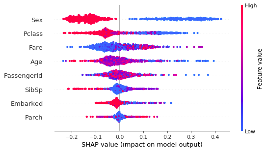
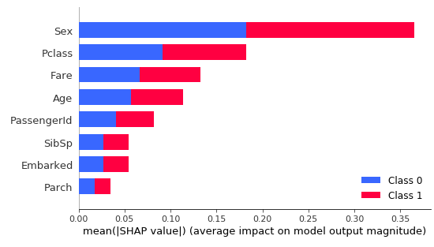
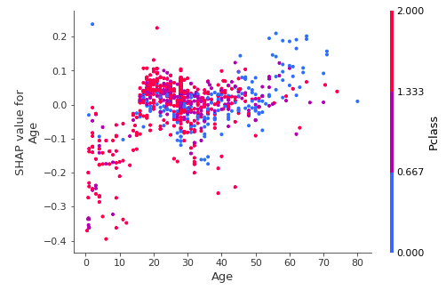
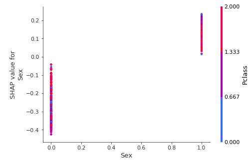

# Explaining black boxes

## Using SHAP (SHapely Additive exPlanation)

### Random Forest

- Overall weight  
  
## Shap values of all the records representing which variable play what kind of role in predicting the output. Eg: Sex when High (Male) playe a negative role in survival but female have very high chances of survival spread across other factors too
  
  
  
  

- Per prediction  

## Using eli5 (Explain like I'm 5)

### Logistic Regression

- Overall weight  
  
- Per prediction  

### Random Forest

- Overall weight  
  
- Per prediction  

## Lime

- Per prediction as it is local  

