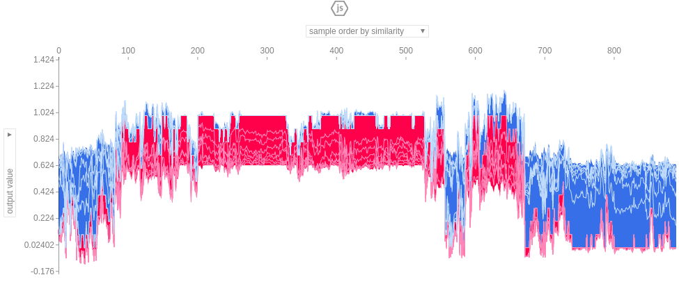
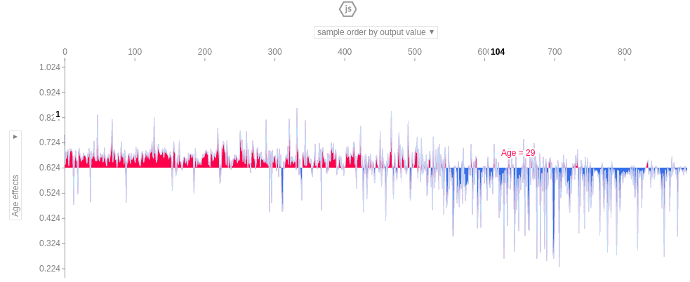
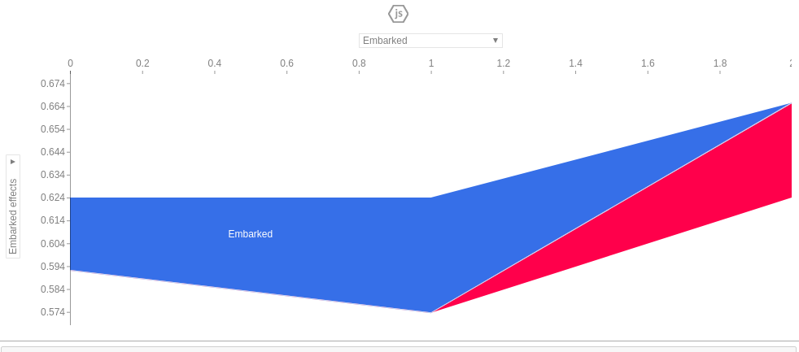
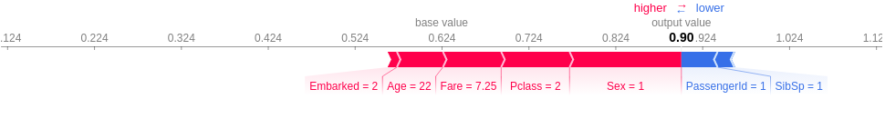
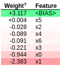
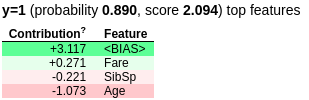
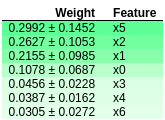
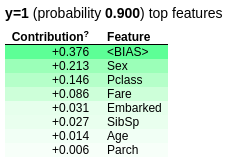
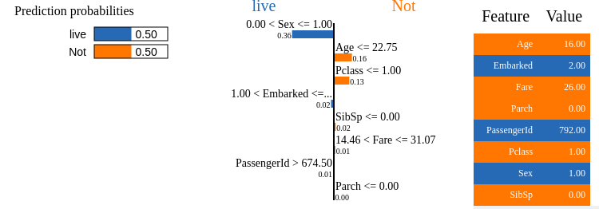

# Explaining black boxes

## Using SHAP (SHapely Additive exPlanation)

### Random Forest

- Overall weight  
  
  
  
- Per prediction  

## Using eli5 (Explain like I'm 5)

### Logistic Regression

- Overall weight  
  
- Per prediction  

### Random Forest

- Overall weight  
  
- Per prediction  

## Lime

- Per prediction as it is local  

